Hello, welcome to the intro to Git and GitHub workshop by Smithies in SDS! This workshop will primarily use the RStudio IDE to interact with Git - which I will demonstrate.

## 1. What is Git? What is GitHub?

In short, **Git** is a version control system. It is a tool to manage different versions of your code/projects (i.e. a repository). **GitHub**, on the other hand, is a (there are a few others) hosting service for Git repositories.

Think of it this way - think of **Git** as the engine of a car, and **GitHub** the dashboard, i.e. **Git** works behind-the-scenes, and **GitHub** is where you where you store the stuff. Another allusion, for example is the difference of R vs RStudio. R is the engine, RStudio, the dashboard.

So in conclusion, they are not the same thing: Git is a tool, GitHub is a service for projects that use Git.

## 2. Installing Git on your computer

Guide: <https://github.com/git-guides/install-git>

First let's make sure, you don't have Git already installed. Open the Windows Command Prompt if you are on windows or the Terminal application if you are on Mac, and type `git version`. If it shows you something like `git version 2.19.2`, you are good to go and can skip this step!

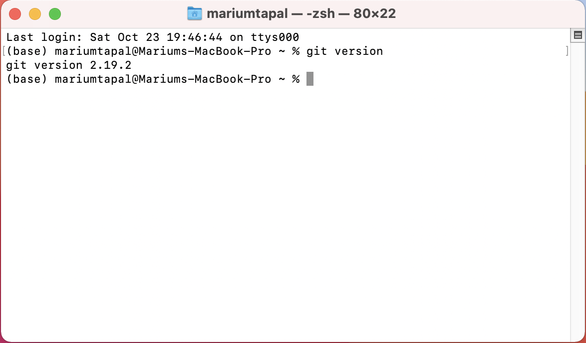{width=75%}

If not, go to the guide and follow the instructions in the `Install Git on Mac` or `Install Git on Windows` sections.

## 3. Creating an account on GitHub

To actually use Git, you need a GitHub account, where your files will be stored. This is pretty much like signing up for a social media account.

Go to <https://github.com/signup?source=login> and follow the instructions!

## 4. Configuring Git on your computer

Now let's open RStudio!

In the bottom left of the screen, you will see something called console. We need to switch to the terminal tab which is right next to it.

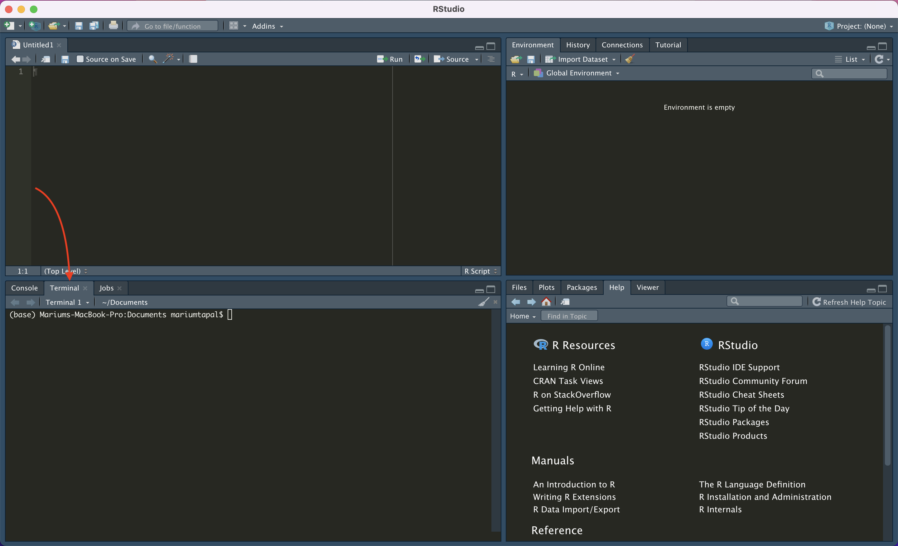{width=75%}

Once you are in the terminal, let's set up Git.

First configure your user name. This is what your user name is on GitHub. For example, I would type:

    $ git config --global user.name "mariumtapal"

Note that you don't actually write the `$` sign.

Then configure your email - the one you used to sign up for your GitHub account:

    $ git config --global user.email mariumtapal@gmail.com

## 5. Create your first repository/project

Now that we have Git configured on your computer, go back to your GitHub profile (on github.com). On the top right corner, you'll see a drop down menu, and click on **Your repositories**:

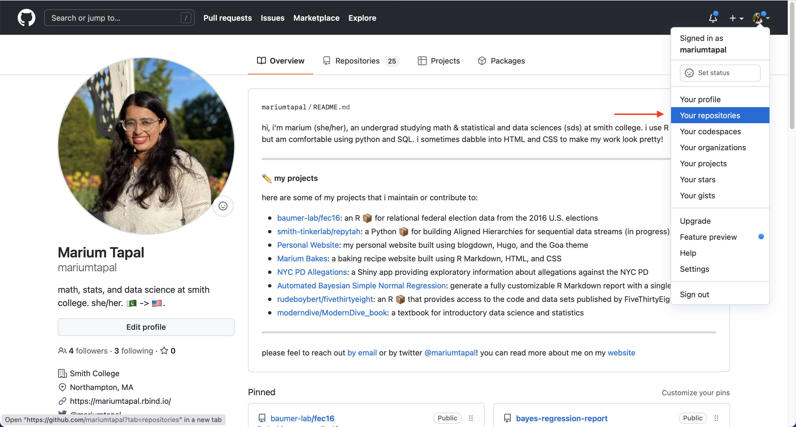{width=75%}

Now you will be at a page that looks somewhat like the one below. Click on the green button that says **New**:

{width=75%}

Now let's create your first repository (often abbreviated to **repo**). First this tutorial, I'll use the following configurations:

-   **No template** in the repository template option
-   give the repository a meaningful name. I'm calling it **test**, you can call it whatever you want!
-   an optional description
-   keeping the repository **public** (that means anyone can see its contents)
-   initializing with a README (which is usually an instruction manual about the contents of your repository)

Finally click the green button called **Create repository**!

{width=75%}

{width=75%}

## 6. Cloning it locally

Now let's get the repository locally!

On your repository page, click on the green code button, switch to `HTTPS` and copy the url as shown in the screenshot below:

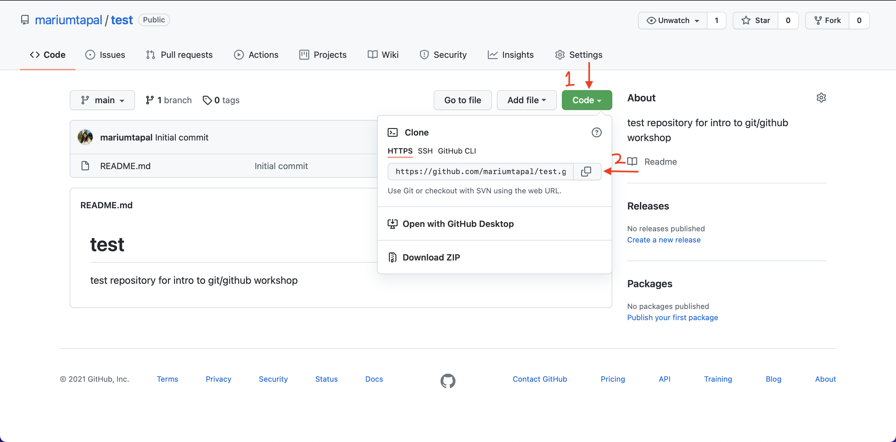{width=75%}

Go back to RStudio. On the top right corner, click on the drop down menu where is says `Project (None)`, then click on `New Project` --\> `Version Control` --\> `Git` and then in the `Repository URL` field, paste the URL. The project directory field will be auto-filled, and then you can select the location where you want the project to live locally in the third field.

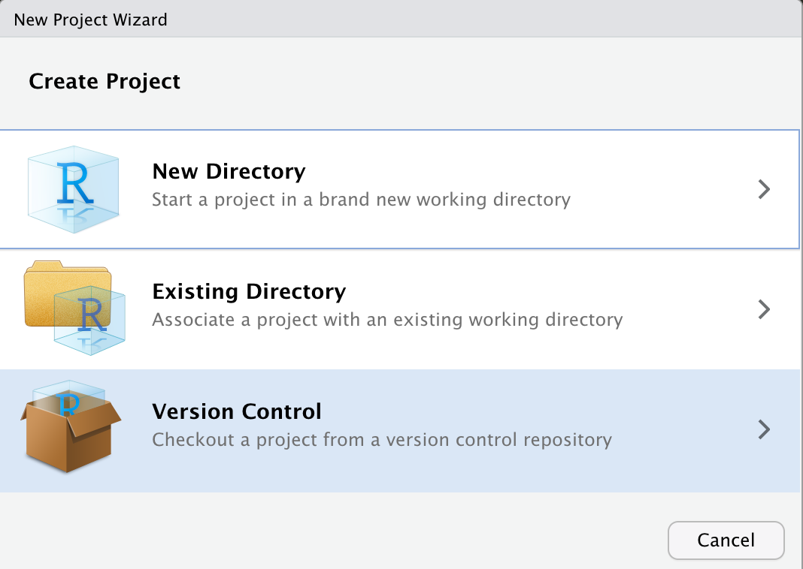{width=50%} 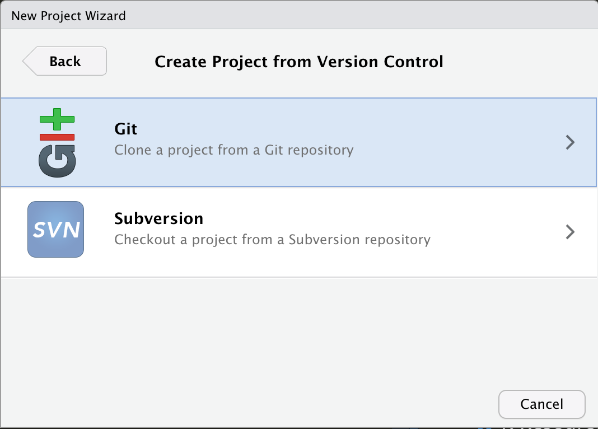{width=50%} 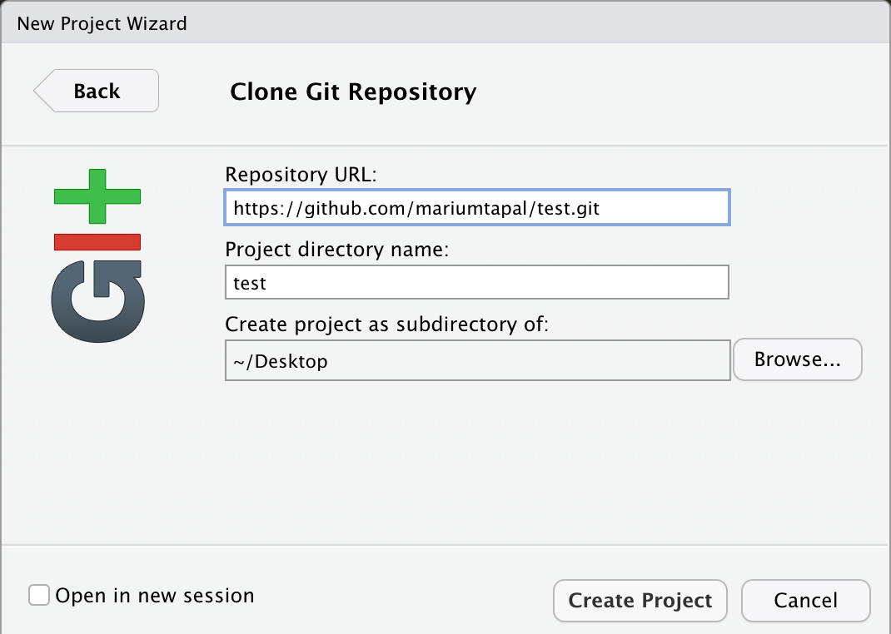{width=50%}

Click **Create Project**, and you have a local R project!

**Note:** If at this point you are asked to enter a password, you actually have to create and enter a Personal Access Token. [Here](https://docs.github.com/en/authentication/keeping-your-account-and-data-secure/creating-a-personal-access-token) is a guide to create one!

## 7. Commits, pushes, & pulls

So how do we get our project on GitHub? We do that through commits, pushes and pulls!

Here is short definition of what each of these things mean. Then I'll show you how to send a file on GitHub, directly from RStusio.

-   A **commit** is saving the state of your code into version control i.e Git
-   A **push** is sending your commited coded to a remote server i.e. GitHub
-   A **pull** is downloading the newest changes from a remote server (i.e. GitHub) to your local repository (on your computer)

So let's put it in action.

1.  Create a new file in the project folder on your computer (or move one here). In the example below, the R script called `jfk_flights.R` is in the folder of my project (look at the arrows). Also look that we have a new tab in the upper right hand of the screen! This is where the committing, pushing, and pulling will happen!

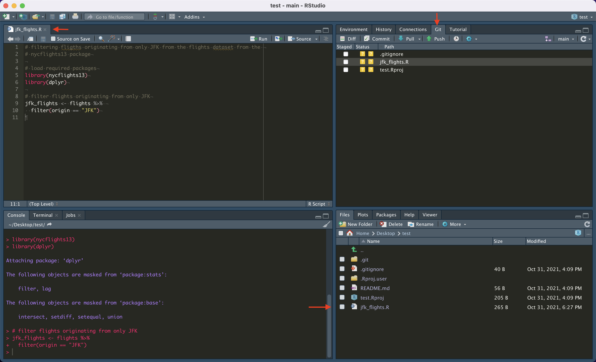{width=75%}

1.  Now let's select the filed we want to put to GitHub. From the **Git** tab, select `jfk_flights.R`, and the other files that were created automatically.

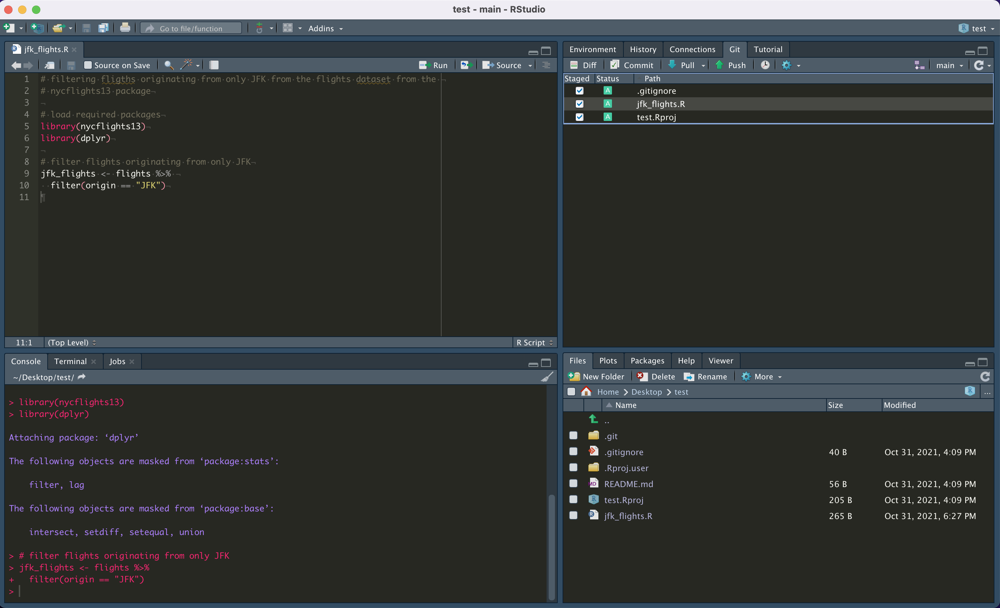{width=75%}

1.  After that we will hit the **commit** button right above that. Clicking the commit button will bring up a new window. Enter a meaningful message in the space provided, so you can remember what you did in this commit. Then click the commit button!

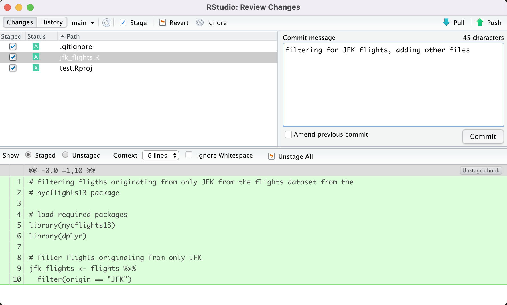{width=75%}

1.  You'll now see a window pop-up that tells you that your commit was successful! Close that window. Now you're back at a screen where it will say "Your branch is ahead of 'origin/main' by 1 commit". This means that your work is at the staging area, right before it is pushed to GitHub. Now click the green arrow button that says push to get your files onto GitHub. Yay! Your work is now on GitHub. You can now go to github to your repository to view your files and commit there!

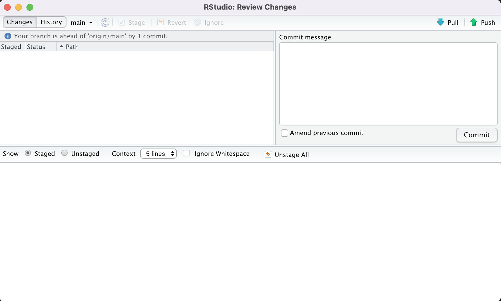{width=75%}

{width=75%}

1.  Finally, what is a pull? A pull is when there are files/updates to files on GitHub, but not on your computer. On RStudio, in the Git panel, there is a **pull** button (a blue arrow) next to the commit button that will do this for you. Right now, since the project on your computer and on GitHub have the same files, **Git** will tell you that your project is "Already up to date."

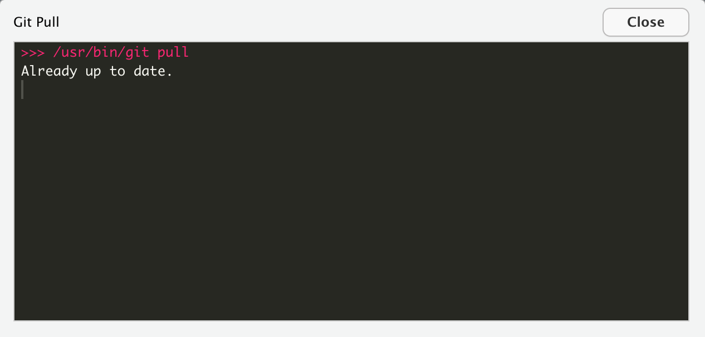{width=75%}

## 8. Extra Stuff!

This was just the starting point of using Git with GitHub! There are a whole bunch of things and tools to work collaboratively and smartly. Forks, Branches, Pull Requests, GitHub Pages are just more things to look into! Infact, this tutorial also lives on GitHub!

If you are curious, here are some resources where you can learn more about these things:

-   Spinelli Center Tutors - Sunday to Thursday, 7-9 pm, Sabin Reed 301
-   Your professor's office hours
-   Book: [Happy Git and GitHub for the useR](https://happygitwithr.com/index.html)
